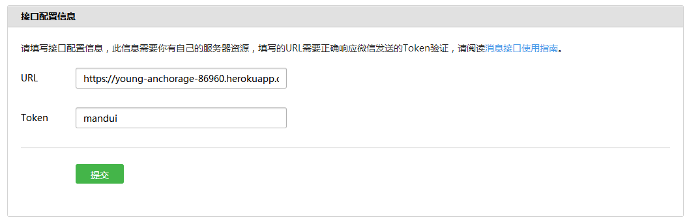

# 开发环境准备

## 账号建立
[测试号申请](https://mp.weixin.qq.com/debug/cgi-bin/sandbox?t=sandbox/login)，这里建的是一个测试号，里面各种api都可以使用，可以任意玩耍。最好收藏一个地址，有时候入口不好找。

## 环境设置

### 服务器交互
首先了解一下公众号的数据走向，如下图所示。用户的信息先传给微信服务器，然后微信服务器根据设置，找到对应的应用服务器，进行数据交互。使用的是http/https请求。


### 接入设置 之 概述
设置中需要指明自己的服务器接入点，并提供一个token。

服务器url需要满足：a. 非IP，即有真实域名；b. 不带端口；c. 支持http或https连接。token随意。



这里微信服务器需要确认，提供的这个服务器能确认消息是否是从微信服务器发出的，这需要在自己的服务器端写一个简单校验的功能。

微信例子里提供了一个php版本的例子，这里附上一个[python版本](main.py)的，在服务器端用如下命令即可满足校验功能。
```
python main.py 80
```

### 接入配置 之 部署

由于作者之前从未有过服务器端的开发经验，所以开始时就想避免使用真实（工作）环境，这里就会有一个问题，需要找一个真实域名的服务器，提供这样一个后台服务。

目前云平台们都纷纷提供了免费的服务器试用，可以拿到公网IP，但这有两个问题：一是只有公网IP是不能配置成功的，而且国内域名需要备案，流程复杂漫长，域名还要花钱，不适合练手；二是代码开发...也许我没找到正确的方式上传代码，但用putty登腾讯云的命令行敲代码确实挺痛苦。

于是以前完全没有服务器端经验的作者几经折腾，找到两个可以成功的方法：Heroku和内网穿透。

#### Heroku
Heroku是一个部署网络应用的平台，相当于一个云后端，里面集成了运行环境需要的所有组件包括各类库、数据库、协议支持等等，主要面向不想自己部署服务器的企业，可以租用不同响应规模的产品。Heroku对于小规模的爱好者（潜在付费用户）是免费的，且用git管理代码，本地远端部署方便。

简单来说，用以下配置，即可成功。
```
URL：https://young-anchorage-86960.herokuapp.com/expr-wechat
Token：mandui
```
1. [注册账户](https://signup.heroku.com/login)：也可以使用i-mandui@outlook.com/mandui@2019登录。

2. 准备工作：Heroku的代码使用git提交的，也就是说，可以在本地写好，用git传到服务器，然后Heroku帮你运行。所以有以下工具需要安装：

    [Git](https://desktop.github.com/)：Github Desktop集成git命令行和GUI。

    [Heroku Cli](https://devcenter.heroku.com/articles/heroku-cli)：Heroku命令行，用于本地远端代码部署。在链接中有详细说明。需要Git支持。

3. [Startup](https://devcenter.heroku.com/start)：Heroku支持多种语言部署，选一个自己熟悉的。Heroku需要识别特定的文件代码结构配置来自动化部署网络服务，所以建议第一回跟着startup教程，部署一个默认project，之后再做修改。每一种语言里面描述都很详细，照着做就好。

4. [代码修改](https://devcenter.heroku.com/articles/getting-started-with-java#push-local-changes)：Startup之后，本地应该有一份代码，修改逻辑之后，用以下命令将更改更新到远端，并开启服务：
```
$ git add *
$ git commit -m "some description"
$ git push heroku master
$ heroku open
```
5. [Log](https://devcenter.heroku.com/articles/getting-started-with-java#view-logs)：可以在命令行这样查看打印日志。

6. Heroku

#### 内网穿透

作者并不是很明白内网穿透具体来说是什么，但它可以达到这样一个效果：将一个真实域名映射到localhost的指定端口，这样就可以用一个域名访问到提供服务的本地服务器了。

使用[ngrok](https://dashboard.ngrok.com/get-started)：注册下载之后，ngrok是一个命令行工具，按照提示操作，之后应该会在命令行看到：
```
Session Status                online
Account                       mandui (Plan: Free)
Version                       2.2.8
Region                        United States (us)
Web Interface                 http://127.0.0.1:4040
Forwarding                    http://013218f9.ngrok.io -> localhost:80
Forwarding                    https://013218f9.ngrok.io -> localhost:80
```
也就是说ngrok将 https://013218f9.ngrok.io 这个地址映射到了本地的80端口，请注意**将本地服务器的端口设置为80**，然后在url上填写这个地址就OK了，当然，本地服务应该*提供的这个服务器能确认消息是否是从微信服务器发出的比对功能*。

ngrok的免费版本，每一次重新运行ngrok都会生成一个新的地址，所以这时就需要在为新配置页面重新设置。

另外还有一种可行的方法（然而作者并未尝试），就是在微信配置时已经成功过之后：
```
1. 修改本地host文件，将127.0.0.1映射到微信配置的url
2. 使用nginx监听80端口，并代理到本地服务器端口
3. 使用openssl制作一个证书，为本地服务器添加https传输能力
4. 这样本地项目发出的请求就回到了本地服务器上，而且url不用改来改去
```
看起来是可行的，但作者觉得有点疑惑的是，本地项目发出的请求不应该是先走微信服务器再转到用户服务器的吗？或是调试时，数据走的不一样？若是有人尝试后有解答，可添在最后。