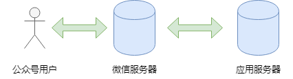

# 开发环境准备

## 账号建立
[测试号申请](https://mp.weixin.qq.com/debug/cgi-bin/sandbox?t=sandbox/login)，这里建的是一个测试号，里面各种api都可以使用，可以任意玩耍。最好收藏一个地址，有时候入口不好找。

## 环境设置

### 服务器交互
首先了解一下公众号的数据走向，如下图所示。用户的信息先传给微信服务器，然后微信服务器根据设置，找到对应的应用服务器，进行数据交互。使用的是http/https请求。



### 接入设置 之 概述
设置中需要指明自己的服务器接入点，并提供一个token。

服务器url需要满足：a. 非IP，即有真实域名；b. 不带端口；c. 支持http或https连接。token随意。


这里微信服务器需要确认，提供的这个服务器能确认消息是否是从微信服务器发出的，这需要在自己的服务器端写一个简单校验的功能。

微信例子里提供了一个php版本的例子，这里附上一个[python版本](main.py)的，在服务器端用如下命令即可满足校验功能。

```
python main.py 80
```

### 接入设置 之 Heroku
